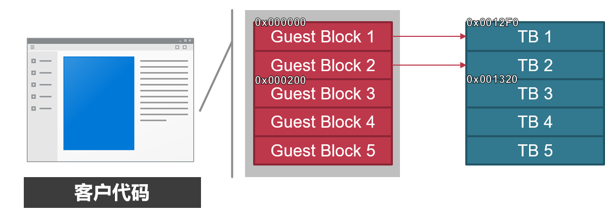
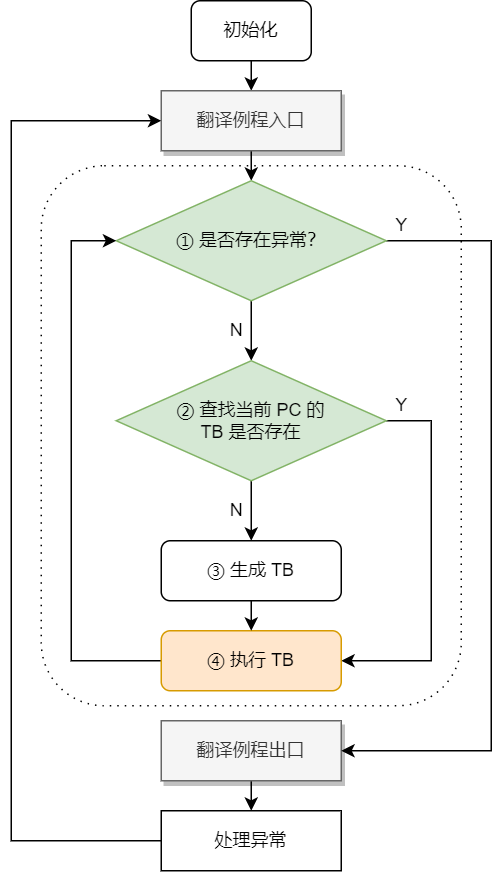

# QEMU Native Compatible Solution

此文档介绍了一种使 QEMU 利用本机动态库提高转译效率的方案，具有较强的兼容性，在一定应用场景下可以使转译速度逼近原生代码。

我们主要关注客户架构为 x86_64 的场景，以下会将其简称为 x64。

## 目录

- Box64
    - Box64 工作原理
    - Box64 

- QEMU
    - QEMU 编译
    - QEMU User 执行流程
        - 翻译流程
        - 异常处理例程
        - 内存映射

- QEMU-NC 设计方案
    - 访存一致性
    - 来宾代理库
    - 函数调用约定转换
    - 函数指针调用检查
    - 多线程
    - 可变长参数处理


## 编译 QEMU

我们是基于 QEMU stable-8.2 修改的。

```sh
sudo apt install ninja-build autoconf python3-pip

git clone https://github.com/rover2024/qemu

cd qemu
git checkout nc

mkdir build
../configure --target-list=x86_64-linux-user --enable-debug
make -j$(nproc)
```

## QEMU 用户态执行流程介绍

### 翻译块（Translation Block，TB）

QEMU 先给客户代码分片（连续的若干个基本块），每一个代码片段未来都将被 JIT 生成为目标体系结构的代码，这份目标代码同样是一个片段，被称为翻译块，简称 TB。

<div style="text-align: center;">
    
</div>

在最初，没有 TB，程序从入口点所在的客户代码块开始准备执行，如果当前块没有对应的 TB，那么为它生成 TB（执行即时编译），再执行。当程序通过顺序、分支执行到其他客户代码块时，也执行上述操作。如此循环往复，最后所有的客户代码块都有了对应的 TB。

### 翻译流程

翻译流程是一个死循环，控制流不停地在翻译例程与异常处理例程之间辗转。

<div style="text-align: center;">
    
</div>

- ① 判断是否存在异常
    - 存在，则退出翻译例程，进入异常处理例程
    - 不存在，则继续【👇】
- ② 查找当前 PC（程序计数器）对应的 TB 是否存在
    - 存在，则跳转 ④
    - 不存在，则继续【👇】
- ③ 生成 TB（只生成不执行）【👇】
- ④ 执行 TB，执行完或出现异常，返回 ①【👆】
    - 执行 TB 过程中，可能遇到异常，如系统调用、除零错误等，此时会立刻中断

我们可以通过代码简单讲解。

> https://github.com/qemu/qemu/blob/stable-8.2/linux-user/main.c#L670
```c++
int main(int argc, char **argv, char **envp)
{
    // ...

    CPUArchState *env;

    // ...

    cpu_loop(env);
    /* never exits */
    return 0;
}
```
在`main.c`中，`main`函数配置好虚拟 CPU 状态后，跳转到`cpu_loop`函数，这是一个永不返回的函数，可想而知它一定包含一个死循环。

> https://github.com/qemu/qemu/blob/stable-8.2/linux-user/i386/cpu_loop.c#L206
```c++
void cpu_loop(CPUX86State *env)
{
    CPUState *cs = env_cpu(env);
    int trapnr;
    abi_ulong ret;

    for(;;) {
        cpu_exec_start(cs);
        trapnr = cpu_exec(cs);
        cpu_exec_end(cs);
        process_queued_cpu_work(cs);

        switch(trapnr) {

        // ...

        default:
            EXCP_DUMP(env, "qemu: unhandled CPU exception 0x%x - aborting\n",
                      trapnr);
            abort();
        }
        process_pending_signals(env);
    }
}  
```
查看`cpu_loop`的实现，在 for 循环中，依次执行了以下内容。
- `cpu_exec_start`：对应上图的**翻译例程入口**，根据其注释可知是等待某些独占例程的完成，并将虚拟 CPU 设置为运行状态。
- `cpu_exec`：对应上图虚线框内的整个**翻译例程**，之后会介绍
- `cpu_exec_end`：对应上图的**翻译例程出口**，根据其注释可知是将虚拟 CPU 设置为挂起状态，并释放一些被挂起的独占例程。

> https://github.com/qemu/qemu/blob/stable-8.2/accel/tcg/cpu-exec.c#L1061
```c++
int cpu_exec(CPUState *cpu)
{
    // ...

    rcu_read_lock();
    cpu_exec_enter(cpu);

    // ...

    ret = cpu_exec_setjmp(cpu, &sc);

    cpu_exec_exit(cpu);
    rcu_read_unlock();

    return ret;
}
```
在`cpu_exec`中，控制流主要是在`cpu_exec_setjmp`中。

> https://github.com/qemu/qemu/blob/stable-8.2/accel/tcg/cpu-exec.c#L1051
```c++
static int cpu_exec_setjmp(CPUState *cpu, SyncClocks *sc)
{
    /* Prepare setjmp context for exception handling. */
    if (unlikely(sigsetjmp(cpu->jmp_env, 0) != 0)) {
        cpu_exec_longjmp_cleanup(cpu);
    }

    return cpu_exec_loop(cpu, sc);
}
```
在`cpu_exec_setjmp`中，控制流主要是在`cpu_exec_loop`中。

> https://github.com/qemu/qemu/blob/stable-8.2/accel/tcg/cpu-exec.c#L965
```c++
static int __attribute__((noinline))
cpu_exec_loop(CPUState *cpu, SyncClocks *sc)
{
    int ret;

    /* if an exception is pending, we execute it here */
    while (!cpu_handle_exception(cpu, &ret)) {
        TranslationBlock *last_tb = NULL;
        int tb_exit = 0;

        while (!cpu_handle_interrupt(cpu, &last_tb)) {
            // ...

            tb = tb_lookup(cpu, pc, cs_base, flags, cflags);
            if (tb == NULL) {
                CPUJumpCache *jc;
                uint32_t h;

                mmap_lock();
                tb = tb_gen_code(cpu, pc, cs_base, flags, cflags);
                mmap_unlock();

                /*
                 * We add the TB in the virtual pc hash table
                 * for the fast lookup
                 */
                h = tb_jmp_cache_hash_func(pc);
                jc = cpu->tb_jmp_cache;
                // ...
            }

            // ...

            cpu_loop_exec_tb(cpu, tb, pc, &last_tb, &tb_exit);

            // ...
        }
    }
    return ret;
}
```
这个函数的逻辑上图虚线框内的翻译例程基本相符，外部两层 while 循环只有在存在中断异常的情况下才会退出，循环内部是先寻找`pc`对应的 TB，找不到就执行`tb_gen_code`生成 TB 并缓存之，再通过`cpu_loop_exec_tb`执行 TB。

### 异常处理例程

以上，我们了解了`cpu_loop`的大循环前面的翻译例程，当翻译例程中出现异常时会退出，并进入后面的 switch 语句进行异常处理。

> https://github.com/qemu/qemu/blob/stable-8.2/linux-user/i386/cpu_loop.c#L206
```c++
void cpu_loop(CPUX86State *env)
{
    CPUState *cs = env_cpu(env);
    int trapnr;
    abi_ulong ret;

    for(;;) {
        // ...

        switch(trapnr) {
        case 0x80:
            // ...
            break;
        
        case EXCP_SYSCALL:
            /* linux syscall from syscall instruction.  */
            ret = do_syscall(env,
                             env->regs[R_EAX],
                             env->regs[R_EDI],
                             env->regs[R_ESI],
                             env->regs[R_EDX],
                             env->regs[10],
                             env->regs[8],
                             env->regs[9],
                             0, 0);
            if (ret == -QEMU_ERESTARTSYS) {
                env->eip -= 2;
            } else if (ret != -QEMU_ESIGRETURN) {
                env->regs[R_EAX] = ret;
            }
            break;

            // ...
        }
    }
}
```
x86 有两种系统调用的方式，分别是`int 80`中断与`syscall`指令，QEMU 兼顾了两种情况，其调用形式是相同的，只是寄存器功能有些许区别。

> https://github.com/qemu/qemu/blob/stable-8.2/linux-user/syscall.c#L13656
```c++
abi_long do_syscall(CPUArchState *cpu_env, int num, abi_long arg1,
                    abi_long arg2, abi_long arg3, abi_long arg4,
                    abi_long arg5, abi_long arg6, abi_long arg7,
                    abi_long arg8)
{
    CPUState *cpu = env_cpu(cpu_env);
    abi_long ret;

    // ...

    ret = do_syscall1(cpu_env, num, arg1, arg2, arg3, arg4,
                      arg5, arg6, arg7, arg8);

    // ...

    return ret;
}
```
`do_syscall`是提供给`cpu_loop`的接口，`do_syscall1`是将参数转发给本机内核的处理函数，内部对各种系统调用号做了包装，这里不做赘述。

我们现在可以理解为什么翻译流程是个死循环了，因为客户程序退出时必然会调用`exit`系统调用，经由`do_syscall`转发给本机，进程直接结束，不需要再经过 QEMU 自己的`main`函数返回。

### QEMU 内存映射

我们编写两个简单的 C 程序，一个编译为动态库，一个编译为可执行程序。

动态库中包含一个加法函数。
```c++
// add.c

__attribute__((visibility("default")))
int add(int x, int y) {
    return x + y;
}
```

可执行程序调用加法，最后进入死循环。
```c++
// main.c

#include <stdio.h>
#include <unistd.h>

int add(int x, int y);

int main(int argc, char *argv[]) {
    printf("PID: %d\n", getpid());

    printf("add result: %d\n", add(argc, 2));

    while (1) {
        sleep(1);
    }
    return 0;
}
```

编译后执行。
```sh
gcc add.c -O2 -shared -o libadd.so
gcc main.c -O2 -L. -ladd -o main.elf

export LD_LIBRARY_PATH=$(pwd)
qemu-x86_64 ./main.elf
```
输出：
```
PID: 19870
add: 3
```

新开一个终端，查看该 PID 的内存映射。
```sh
cat /proc/19870/maps
```
输出：
```
2aaaaaaab000-2aaaaaaac000 ---p 00000000 00:00 0 
2aaaaaaac000-2aaaab2ac000 rw-p 00000000 00:00 0 
2aaaab2ac000-2aaaab2d8000 r--p 00000000 08:10 53169                      /usr/lib/x86_64-linux-gnu/ld-2.31.so
2aaaab2d8000-2aaaab2d9000 ---p 00000000 00:00 0 
2aaaab2d9000-2aaaab2da000 r--p 0002c000 08:10 53169                      /usr/lib/x86_64-linux-gnu/ld-2.31.so
2aaaab2da000-2aaaab2db000 rw-p 0002d000 08:10 53169                      /usr/lib/x86_64-linux-gnu/ld-2.31.so
2aaaab2db000-2aaaab2dc000 rw-p 00000000 00:00 0 
2aaaab2dc000-2aaaab2dd000 r--p 00000000 00:00 0 
2aaaab2dd000-2aaaab2e1000 rw-p 00000000 00:00 0 
2aaaab2e1000-2aaaab2e4000 r--p 00000000 08:10 216923                     /home/test/libadd.so
2aaaab2e4000-2aaaab2e5000 r--p 00002000 08:10 216923                     /home/test/libadd.so
2aaaab2e5000-2aaaab2e6000 rw-p 00003000 08:10 216923                     /home/test/libadd.so
2aaaab2f4000-2aaaab4db000 r--p 00000000 08:10 53288                      /usr/lib/x86_64-linux-gnu/libc-2.31.so
2aaaab4db000-2aaaab4dc000 ---p 001e7000 08:10 53288                      /usr/lib/x86_64-linux-gnu/libc-2.31.so
2aaaab4dc000-2aaaab4df000 r--p 001e7000 08:10 53288                      /usr/lib/x86_64-linux-gnu/libc-2.31.so
2aaaab4df000-2aaaab4e2000 rw-p 001ea000 08:10 53288                      /usr/lib/x86_64-linux-gnu/libc-2.31.so
2aaaab4e2000-2aaaab4e9000 rw-p 00000000 00:00 0 
555555556000-555555559000 r--p 00000000 08:10 216925                     /home/test/main.elf
555555559000-55555555a000 r--p 00002000 08:10 216925                     /home/test/main.elf
55555555a000-55555555b000 rw-p 00003000 08:10 216925                     /home/test/main.elf
55555555b000-55555557c000 rw-p 00000000 00:00 0 
557bf88c4000-557bf88fb000 r--p 00000000 08:10 157968                     /home/qemu/qemu-x86_64
557bf88fb000-557bf8aaf000 r-xp 00037000 08:10 157968                     /home/qemu/qemu-x86_64
557bf8aaf000-557bf8b48000 r--p 001eb000 08:10 157968                     /home/qemu/qemu-x86_64
557bf8b49000-557bf8b65000 r--p 00284000 08:10 157968                     /home/qemu/qemu-x86_64
557bf8b65000-557bf8b94000 rw-p 002a0000 08:10 157968                     /home/qemu/qemu-x86_64
557bf8b94000-557bf8b9f000 rw-p 00000000 00:00 0 
557bf9834000-557bf9929000 rw-p 00000000 00:00 0                          [heap]
7f1c00000000-7f1c07fff000 rwxp 00000000 00:00 0 
7f1c07fff000-7f1c08000000 ---p 00000000 00:00 0 
7f1c08000000-7f1c08021000 rw-p 00000000 00:00 0 
7f1c08021000-7f1c0c000000 ---p 00000000 00:00 0 
7f1c0e959000-7f1c0e9da000 rw-p 00000000 00:00 0 
7f1c0e9da000-7f1c0e9db000 ---p 00000000 00:00 0 
7f1c0e9db000-7f1c0f1dd000 rw-p 00000000 00:00 0 
7f1c0f1dd000-7f1c0f1df000 r--p 00000000 08:10 53955                      /usr/lib/x86_64-linux-gnu/libpcre.so.3.13.3
7f1c0f1df000-7f1c0f230000 r-xp 00002000 08:10 53955                      /usr/lib/x86_64-linux-gnu/libpcre.so.3.13.3
7f1c0f230000-7f1c0f24e000 r--p 00053000 08:10 53955                      /usr/lib/x86_64-linux-gnu/libpcre.so.3.13.3
7f1c0f24e000-7f1c0f24f000 r--p 00070000 08:10 53955                      /usr/lib/x86_64-linux-gnu/libpcre.so.3.13.3
7f1c0f24f000-7f1c0f250000 rw-p 00071000 08:10 53955                      /usr/lib/x86_64-linux-gnu/libpcre.so.3.13.3
7f1c0f250000-7f1c0f275000 r--p 00000000 08:10 53288                      /usr/lib/x86_64-linux-gnu/libc-2.31.so
7f1c0f275000-7f1c0f3ed000 r-xp 00025000 08:10 53288                      /usr/lib/x86_64-linux-gnu/libc-2.31.so
7f1c0f3ed000-7f1c0f437000 r--p 0019d000 08:10 53288                      /usr/lib/x86_64-linux-gnu/libc-2.31.so
7f1c0f437000-7f1c0f438000 ---p 001e7000 08:10 53288                      /usr/lib/x86_64-linux-gnu/libc-2.31.so
7f1c0f438000-7f1c0f43b000 r--p 001e7000 08:10 53288                      /usr/lib/x86_64-linux-gnu/libc-2.31.so
7f1c0f43b000-7f1c0f43e000 rw-p 001ea000 08:10 53288                      /usr/lib/x86_64-linux-gnu/libc-2.31.so
7f1c0f43e000-7f1c0f444000 rw-p 00000000 00:00 0 
7f1c0f444000-7f1c0f44b000 r--p 00000000 08:10 54030                      /usr/lib/x86_64-linux-gnu/libpthread-2.31.so
7f1c0f44b000-7f1c0f45c000 r-xp 00007000 08:10 54030                      /usr/lib/x86_64-linux-gnu/libpthread-2.31.so
7f1c0f45c000-7f1c0f461000 r--p 00018000 08:10 54030                      /usr/lib/x86_64-linux-gnu/libpthread-2.31.so
7f1c0f461000-7f1c0f462000 r--p 0001c000 08:10 54030                      /usr/lib/x86_64-linux-gnu/libpthread-2.31.so
7f1c0f462000-7f1c0f463000 rw-p 0001d000 08:10 54030                      /usr/lib/x86_64-linux-gnu/libpthread-2.31.so
7f1c0f463000-7f1c0f467000 rw-p 00000000 00:00 0 
7f1c0f467000-7f1c0f468000 r--p 00000000 08:10 53553                      /usr/lib/x86_64-linux-gnu/libgmodule-2.0.so.0.6400.6
7f1c0f468000-7f1c0f46a000 r-xp 00001000 08:10 53553                      /usr/lib/x86_64-linux-gnu/libgmodule-2.0.so.0.6400.6
7f1c0f46a000-7f1c0f46b000 r--p 00003000 08:10 53553                      /usr/lib/x86_64-linux-gnu/libgmodule-2.0.so.0.6400.6
7f1c0f46b000-7f1c0f46c000 r--p 00003000 08:10 53553                      /usr/lib/x86_64-linux-gnu/libgmodule-2.0.so.0.6400.6
7f1c0f46c000-7f1c0f46d000 rw-p 00004000 08:10 53553                      /usr/lib/x86_64-linux-gnu/libgmodule-2.0.so.0.6400.6
7f1c0f46d000-7f1c0f489000 r--p 00000000 08:10 53539                      /usr/lib/x86_64-linux-gnu/libglib-2.0.so.0.6400.6
7f1c0f489000-7f1c0f50d000 r-xp 0001c000 08:10 53539                      /usr/lib/x86_64-linux-gnu/libglib-2.0.so.0.6400.6
7f1c0f50d000-7f1c0f593000 r--p 000a0000 08:10 53539                      /usr/lib/x86_64-linux-gnu/libglib-2.0.so.0.6400.6
7f1c0f593000-7f1c0f594000 r--p 00125000 08:10 53539                      /usr/lib/x86_64-linux-gnu/libglib-2.0.so.0.6400.6
7f1c0f594000-7f1c0f595000 rw-p 00126000 08:10 53539                      /usr/lib/x86_64-linux-gnu/libglib-2.0.so.0.6400.6
7f1c0f595000-7f1c0f596000 rw-p 00000000 00:00 0 
7f1c0f596000-7f1c0f5a5000 r--p 00000000 08:10 53783                      /usr/lib/x86_64-linux-gnu/libm-2.31.so
7f1c0f5a5000-7f1c0f64c000 r-xp 0000f000 08:10 53783                      /usr/lib/x86_64-linux-gnu/libm-2.31.so
7f1c0f64c000-7f1c0f6e3000 r--p 000b6000 08:10 53783                      /usr/lib/x86_64-linux-gnu/libm-2.31.so
7f1c0f6e3000-7f1c0f6e4000 r--p 0014c000 08:10 53783                      /usr/lib/x86_64-linux-gnu/libm-2.31.so
7f1c0f6e4000-7f1c0f6e5000 rw-p 0014d000 08:10 53783                      /usr/lib/x86_64-linux-gnu/libm-2.31.so
7f1c0f6e5000-7f1c0f6e8000 r--p 00000000 08:10 54073                      /usr/lib/x86_64-linux-gnu/librt-2.31.so
7f1c0f6e8000-7f1c0f6ec000 r-xp 00003000 08:10 54073                      /usr/lib/x86_64-linux-gnu/librt-2.31.so
7f1c0f6ec000-7f1c0f6ed000 r--p 00007000 08:10 54073                      /usr/lib/x86_64-linux-gnu/librt-2.31.so
7f1c0f6ed000-7f1c0f6ee000 ---p 00008000 08:10 54073                      /usr/lib/x86_64-linux-gnu/librt-2.31.so
7f1c0f6ee000-7f1c0f6ef000 r--p 00008000 08:10 54073                      /usr/lib/x86_64-linux-gnu/librt-2.31.so
7f1c0f6ef000-7f1c0f6f0000 rw-p 00009000 08:10 54073                      /usr/lib/x86_64-linux-gnu/librt-2.31.so
7f1c0f6f0000-7f1c0f6f1000 r--p 00000000 08:10 53380                      /usr/lib/x86_64-linux-gnu/libdl-2.31.so
7f1c0f6f1000-7f1c0f6f3000 r-xp 00001000 08:10 53380                      /usr/lib/x86_64-linux-gnu/libdl-2.31.so
7f1c0f6f3000-7f1c0f6f4000 r--p 00003000 08:10 53380                      /usr/lib/x86_64-linux-gnu/libdl-2.31.so
7f1c0f6f4000-7f1c0f6f5000 r--p 00003000 08:10 53380                      /usr/lib/x86_64-linux-gnu/libdl-2.31.so
7f1c0f6f5000-7f1c0f6f6000 rw-p 00004000 08:10 53380                      /usr/lib/x86_64-linux-gnu/libdl-2.31.so
7f1c0f6f6000-7f1c0f6f8000 rw-p 00000000 00:00 0 
7f1c0f706000-7f1c0f707000 r--p 00000000 08:10 53169                      /usr/lib/x86_64-linux-gnu/ld-2.31.so
7f1c0f707000-7f1c0f72a000 r-xp 00001000 08:10 53169                      /usr/lib/x86_64-linux-gnu/ld-2.31.so
7f1c0f72a000-7f1c0f732000 r--p 00024000 08:10 53169                      /usr/lib/x86_64-linux-gnu/ld-2.31.so
7f1c0f733000-7f1c0f734000 r--p 0002c000 08:10 53169                      /usr/lib/x86_64-linux-gnu/ld-2.31.so
7f1c0f734000-7f1c0f735000 rw-p 0002d000 08:10 53169                      /usr/lib/x86_64-linux-gnu/ld-2.31.so
7f1c0f735000-7f1c0f736000 rw-p 00000000 00:00 0 
7ffcb582e000-7ffcb5850000 rw-p 00000000 00:00 0                          [stack]
7ffcb5900000-7ffcb5904000 r--p 00000000 00:00 0                          [vvar]
7ffcb5904000-7ffcb5905000 r-xp 00000000 00:00 0                          [vdso]
```

使用 QEMU 用户态模拟我们的可执行程序`main.elf`，然后 QEMU 从`main.elf`的段中找到解释器，首先加载`/usr/lib/x86_64-linux-gnu/ld-2.31.so`，之后开始翻译执行解释器，而后解释器会加载`libadd.so`，最后进入`main.elf`的入口。

我们通过以上输出可以发现，`qemu-x86_64`（地址`0x557bf88c4000-0x557bf8b94000`）位于系统堆区`[heap]`（地址`0x557bf9834000-0x557bf9929000`向低地址的方向，并且紧贴着堆区，再往低地址方向一小段距离是`main.elf`（地址`0x555555556000`），且`main.elf`是全部没有执行权限的，因为它是被翻译的。在最低地址的地方（低于`0x2aaaab4e9000`）是客户解释器与所有的客户动态库，包括我们的`libadd.so`，它们同样没有执行权限。

而在堆区向高地址的方向，跨越了很大一片地址空间，是本地动态库（高于`0x7f1c0f1dd000`）。

随着程序的运行，当程序申请更多的内存时，堆区将会从`0x557bf9929000`（`[heap]`的高地址边界）向高地址方向扩展，当程序动态加载更多的本地动态库时，本地动态库的地址空间将会从`0x7f1c0f1dd000`（`libpcre.so.3.13.3`的低地址边界）向低地址方向扩展。

从这些信息中，我们能得出一个关键结论，即包括`main.elf`与`libadd.so`在内的所有客户代码片段，与所有本地动态库，它们的的地址空间恰好被堆区、`qemu-x86_64`分隔在了两侧，在这个前提下，我们只需要知道`qemu-x86_64`内部任意一个代码片段的地址，就能判断任意给定的一个地址是客户地址还是本机动态库地址，这个结论对于我们的方案非常重要。

## Box64 方案介绍

TODO

## Windows Arm64EC 方案介绍

TODO

## QEMU-NC 的元编译方案

为了降低工作量，我们需要尽可能少地修改 QEMU 与编译器，所以本方案是一个临时解决方案，虽然具有一定的普适性，但不符合工程规范。

为了方便区分，本节中我们提到的二进制文件名中会添加架构名。

还是上述的`main.c`与`add.c`，它们在一台 x64 的设备上分别被编译为`main-x64.elf`与`libadd-x64.so`，前者依赖后者，它们共同依赖`libc`与`ld`（分别是`libc-x64.so`、`ld-x64.so`）。

它们作为客户架构已经编译好的二进制，我们要让它们在一台 arm64 的设备上借助 QEMU 执行。

最经典的做法就是全部模拟，将这四个文件发送到 arm64 的设备上，然后直接用 arm64 上的`qemu-x86_64`执行`main-x64.elf`，这就是全模拟，可想而知效率很低。

我们在 arm64 上编译`add.c`得到了`libadd-arm64.so`，并且我们希望的是让 QEMU 调用`libadd-x64.so`的时候实际上执行的是`libadd-arm64.so`。

由于 QEMU 本身只能调用`libadd-x64.so`，那么我们就欺骗 QEMU，让 QEMU 以为自己调用的是`libadd-x64.so`，实则是调用`libadd-arm64.so`。

#### 初始化与函数调用

我们只需准备一个假的`libadd-x64.so`，它的导出符号与真身完全相同，都是一个`add`函数，但是它的`add`的实现是一个通过魔法系统调用与 QEMU 交互的包装器。

首先准备一些使用内联汇编直接进行系统调用的包装函数：
```c++
// syscall_helper.h

static inline uint64_t syscall1(uint64_t syscall_number, void *arg);
static inline uint64_t syscall2(uint64_t syscall_number, void *arg1, void *arg2);
static inline uint64_t syscall3(uint64_t syscall_number, void *arg1, void *arg2, void *arg3);
static inline uint64_t syscall4(uint64_t syscall_number, void *arg1, void *arg2, void *arg3,
                                void *arg4)

// 示例
static inline uint64_t syscall1(uint64_t syscall_number, void *arg) {
    uint64_t ret;
    __asm__ volatile("movq %1, %%rax\n\t"            // 加载系统调用号到 rax
                     "movq %2, %%rdi\n\t"            // 加载参数到 rdi
                     "syscall\n\t"                   // 执行系统调用
                     "movq %%rax, %0\n\t"            // 将返回值存储在 ret 中
                     : "=r"(ret)                     // 输出列表
                     : "r"(syscall_number), "r"(arg) // 输入列表
                     : "%rax", "%rdi", "memory"      // 被改变的寄存器列表
    );
    return ret;
}

// ...
```

然后我们准备与动态库相关的函数：
```c++
// loaderapi.h

const int X64NC_MAGIC_SYSCALL_INDEX = 114514;
enum X64NC_MAGIC_SYSCALL_TYPE {
    X64NC_LoadLibrary = 0x1,
    X64NC_FreeLibrary,
    X64NC_GetProcAddress,
    X64NC_GetErrorMessage,
    X64NC_CallNativeProc,
};

void *x64nc_LoadLibrary(const char *path, int flags);
void x64nc_FreeLibrary(void *handle);
void *x64nc_GetProcAddress(void *handle, const char *name);
void x64nc_GetErrorMessage();
```
```c++
// loaderapi.cpp

#include "loaderapi.h"
#include "syscall_helper.h"

void *x64nc_LoadLibrary(const char *path, int flags) {
    void *a[] = { (char *) (path), &flags };
    return (void *) syscall2(X64NC_MAGIC_SYSCALL_INDEX, (void *) X64NC_LoadLibrary, a);
}

void x64nc_FreeLibrary(void *handle) {
    void *a[] = { handle };
    syscall2(X64NC_MAGIC_SYSCALL_INDEX, (void *) X64NC_FreeLibrary, a);
}

void *x64nc_GetProcAddress(void *handle, const char *name) {
    void *a[] = { handle, const_cast<char *>(name) };
    return (void *) syscall2(X64NC_MAGIC_SYSCALL_INDEX, (void *) X64NC_GetProcAddress, a);
}

char *x64nc_GetErrorMessage() {
    return (char *) syscall1(X64NC_MAGIC_SYSCALL_INDEX, (void *) X64NC_GetErrorMessage);
}

void x64nc_CallNativeProc(void *func, void *args, void *ret) {
    void *a[] = { func, args, ret };
    syscall3(X64NC_MAGIC_SYSCALL_INDEX, (void *) X64NC_CallNativeProc, a);
}
```

然后我们编写这个用来欺骗的`add`库：
```c++
// add-fake.c

#include <dlfcn.h>
#include <stddef.h>

#include "loaderapi.h"

// add 函数（本地）指针
static void *p_add = NULL;

// 动态库初始化时通知 QEMU 加载对应的本地库，并初始化符号
static void __attribute__((constructor)) _x64nc_init() {
    void *handle = x64nc_LoadLibrary("libadd-arm64.so", RTLD_NOW);
    p_add = x64nc_GetProcAddress(handle, "add");
}

int add(int x, int y) {
    void *a[] = { &x, &y };
    int ret;
    x64nc_CallNativeProc(p_add, a, &ret);
    return ret;
}
```
我们将`add-fake.c`与`loaderapi.cpp`一起编译为 fake 版的`libadd-x64.so`，替换掉它的真身。

如此这般，QEMU 模拟时，初始化顺序是这样的：
- 加载`main.elf`，找到它的解释器`ld-x64.so`
- 加载`ld-x64.so`，转到`ld-x64.so`的入口点开始模拟执行
- `ld-x64.so`解析`main.elf`的依赖表，然后加载`libc-x64.so`与`libadd-x64.so`
- `libadd-x64.so`中的构造器段`.init_array`中包含`_x64nc_init`，这个函数会立即执行，于是就会产生两个魔法系统调用
- QEMU 接收到了这个系统调用，发现它不是正常的系统调用，然后按照我们制定的规则解析系统调用的参数，加载本地的`libadd-arm64.so`并获得`add`函数的地址
- `libadd-x64.so`中的`p_add`被赋值为`libadd-arm64.so`中`add`的地址

在`main.elf`调用`add`时，`libadd-x64.so`将发起一个魔法系统调用，QEMU 发现又不是正常的系统调用，便会按照我们制定的规则，从系统调用的参数中解析出`x`与`y`，然后调用真正的`add`函数。

以上只是一个简化的模型，真实场景下，x64 与 arm64 的函数调用约定是不同的，因此 QEMU 解析出`x`与`y`后还需要通过 arm64 下的调用约定去访问`libadd-arm64.so`。

## 修改 QEMU

### 1. 禁用客户地址偏移

> https://github.com/qemu/qemu/blob/stable-8.2/linux-user/main.c#L367
```c++
static void handle_arg_guest_base(const char *arg)
{
    guest_base = strtol(arg, NULL, 0);
    have_guest_base = true;
}
```
客户代码中访存指令的地址，在执行时翻译为本机的地址，此处的`guest_base`就是两者的差。

由于我们要利用本地动态库，传入动态库的数据中不可避免地会包含客户指针，因此本机代码无法区分它要访问的内存属于客户架构还是本机架构，因此这两个地址必须相同。

因此我们必须将这个函数的实现注释掉。

### 2. 添加魔法系统调用的处理逻辑

TODO

### 3. 添加调用接口

我们需要为 QEMU 导出两个函数，使本地动态库检查出目标地址是一个 Guest 地址时，能够使用。
- 查找客户架构的 Thunk
- 翻译例程入口

## 编译方案设计

### 使本机编译器支持 CFG

clang 编译器支持用户通过编写插件的方式参与编译流程，我们可以编写一个插件 clang-cfg-plugin，用来给源代码添加调用检查器（Call Checker Guard）。

如以下代码，
```c++
typedef int (*Add)(int, int);
void Host_Library_Function(Add add, int x, int y) {
    int sum = add(x, y);

    // ...
}
```

clang 编译器在解析成 AST 了以后，会把 AST 依次传给每个参与编译流程的插件。插件会将 AST 修改为：
```c++
typedef void *(*LookUpThunk)(const char */*signature*/);
typedef void (*TranslatorRoutine)(void */*thunk*/, void */*func*/, void */*args*/, void */*ret*/);

extern uintptr_t QEMU_Address;
extern LookUpThunk QEMU_LookUpThunk;
extern TranslatorRoutine QEMU_TranslatorRoutine;

typedef int (*Add)(int, int);
int check_guard_i_ii(Add add, int x, int y) {
    if ((uintptr_t) add > QEMU_Address) {
        // Host 地址
        return add(x, y);
    }

    // Guest 地址
    static void *thunk = QEMU_LookUpThunk("i_ii");
    void *a[] = {
        &x, &y,
    };
    int ret = 0;
    QEMU_TranslatorRoutine(thunk, add, a, &ret);
    return ret;
}

void Host_Library_Function(Add add, int x, int y) {
    int sum = check_guard_i_ii(add, x, y);

    // ...
}
```

同时，此插件还会收集本次编译的全部参数，将其记录在外部的一个 json 文件中。

### 编译 fake 动态库

当编译完本地动态库后，插件生成的 json 文件中，已经有了此库源代码的全部信息与构建参数。

我们再编写一个工具，读取这个 json 文件，获取库中出现的所有函数指针调用的函数签名，生成 fake 库的源代码，fake 库的源代码中不仅包含以魔法系统调用为实现的各函数，还包含所有函数指针签名的 Thunk，这些 Thunk 会在 QEMU 加载 fake 库时注册，而后本机库的 CFG 中就能查找到了。

我们只需调用客户架构编译器生成一份 fake 库。


```sh
> qemu-x86_64 --help | grep GUEST_BASE
-B address           QEMU_GUEST_BASE      set guest_base address to 'address'
```